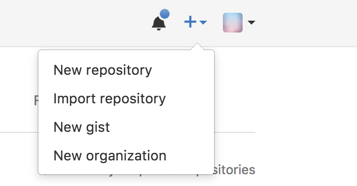
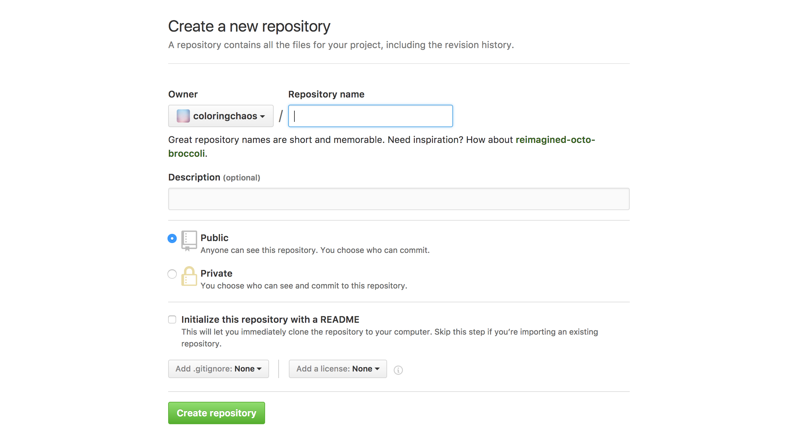
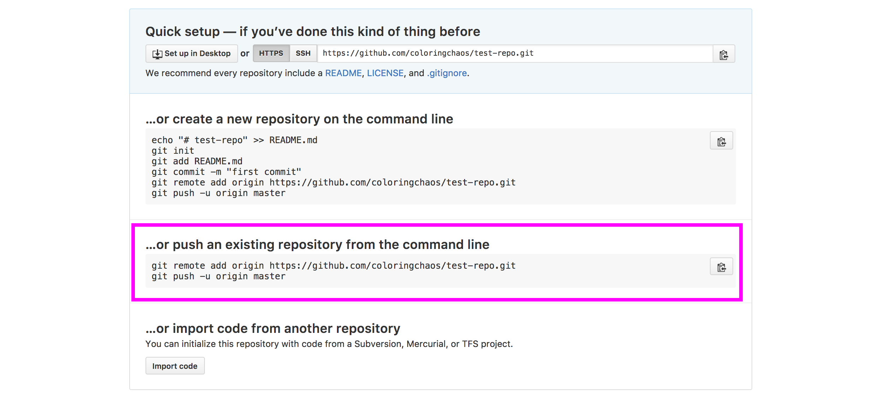

### Git in the Command Line

In this class, we will be using Git and GitHub via the command line - using Terminal on OSX and Command Prompt on Windows. 

Reasons for using git/github this way - the command line is the only place you can run ***all*** Git commands – most of the GUIs only implement some subset of Git functionality for simplicity. If you know how to run the command line version, you can probably also figure out how to run the GUI version, while the opposite is not necessarily true. 

 

### Make sure Git is installed

	$ git —-version

Git comes installed on Macs by default, although you may need to install the command line developer tools. The version of git doesn’t matter, it just needs to be installed.

 

### Configuration

	$ git config --global user.name “<YOUR NAME HERE>”

	$ git config --global user.email “<YOUR EMAIL HERE>”

This is used to associate your name and email with GitHub. This should be the same email address that you used to sign up for Github.
*You only need to do this once.*

 

### Basic Command Line Tools

`$ ls` - list your files


`$ mv srcfile destfile` - move a file


`$ cp srcfile destfile` - copy a file


`$ rm filename` - remove a file


`$ touch filename` - create a new empty file

`$ mkdir` - make a new directory


`$ cd dirname` - change directory


`$ pwd` - tell you where you are


`$ chmod options target` - change permissions on the target

 

### Create a local Git Repository

***You only need to do this once, when you are first setting up your repository.***

Navigate to the folder you want to make the repository in and type:

	$ git init


This will initiate an empty repository in the folder. Again, ***only need to do this once!***

 

### Checking the Status

You will be doing this constantly! Navigate to your repository and type:

	$ git status

Git will show you all of the changes you’ve made within that repository - added files, deleted files, and changes within the files themselves

 

### Adding and Committing Local Files to Git

<i class="fa fa-star-o" aria-hidden="true"></i>***Any time you make a change to your code and want to save this version to git, you will go through this step!!*** 

**Add** the files to the staging area. Navigate to your repository and type:

`$ git add .
` - this will add all files

*or*

`$ git add <FILE NAME>` - this will add only that particular file

Git will mark these files as tracked. Now you can **commit** those files to git:

	$ git commit -m “<MESSAGE HERE>”


***IMPORTANT: Git will NOT commit your files without a message!!*** 

Be as detailed as possible in your messages! It really helps when checking your logs later to figure out what changes were made

 

### Create a Github Repository

***You only need to do this once, when you are first setting up your repository.***

Go to [Github](https://github.com/) and on the top right corner, click the + sign

<!--  -->

Give the repository a name and choose 'Create Repository'

Find the section ***'…or push an existing repository from the command line'*** - copy and paste those two lines into the command line and press enter. 

Now refresh the page at github.com and you should see your code there!

 

### Updating a Github Repo - aka Pushing Changes

After you have committed files locally to git, you can push (or update) them on github using the following command: 

	$ git push origin master

 
 

