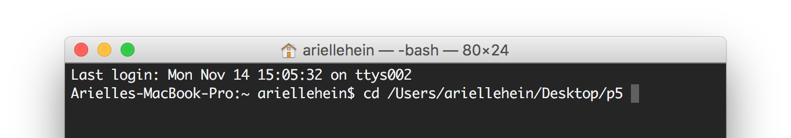
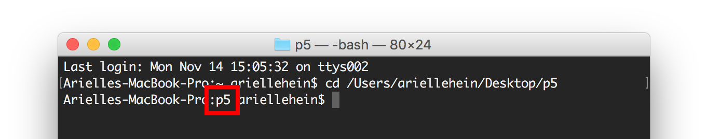
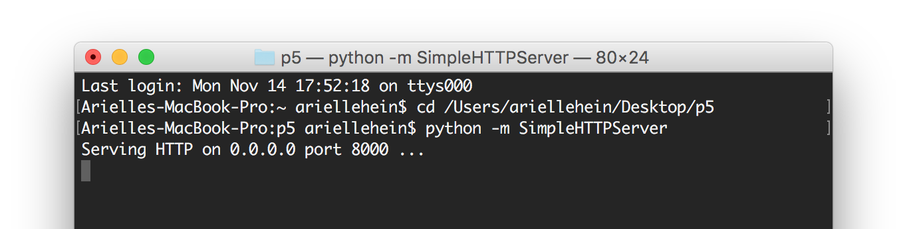
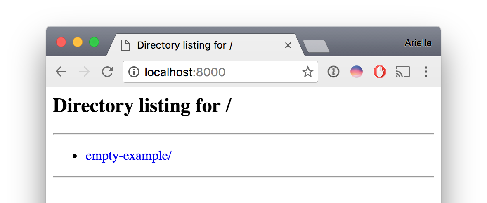
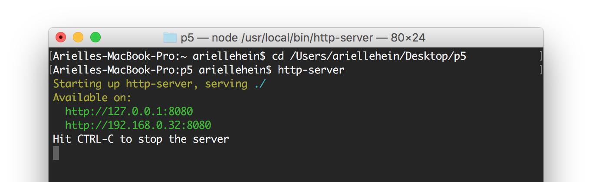

It is a common practice to run a local server during web development. Certain functionality, including many aspects of [p5](http://p5js.org/), rely on a server to host the project. 

Everything will work as expected when the files are placed online via FTP or SSH, but if you do not run a local server during development, you will get cross-origin errors in the console when you try to view the project locally. When working with p5, you must run a local server for loading external files and using the p5 sound library among other things. 

You have two options for running a local web server - Python or Node.js. Instructions for running both are folliwng:

 

### Python SimpleHTTPServer

Python comes with a simple builtin HTTP server. With the help of this little HTTP server you can turn any directory in your system into your web server directory. The only thing you need to have installed is Python (Python is already installed if you are using Mac OS X). 

Open the Command Line (Terminal on a Mac, Command Prompt on Windows). To verify that you have Python installed, enter the following commnad:

	python --version

Change directories to your p5 folder. Use the cd command (with a space after) then drag your p5 folder into the Terminal window. 

Press **ENTER**. Verify that you are now located inside that p5 folder.

To start a simple python server, type the following command, then press ENTER.

	python -m SimpleHTTPServer

You’ll receive feedback in the command line that a server has been started. To view your page in the browser, go to: localhost:port, in this case, localhost:8000. You can click on the project directory to preview that page in the browser.

 

### Node HTTP Server

An alternative is node.js http-server. It is much faster than a python simple server, but requires a little bit of setup.

[Download and Install node.js](https://nodejs.org/en/download/)

Open a terminal or command prompt

On OSX/Linux type

	sudo npm install -g http-server

On Windows type (you might need to open the command prompt as admin)

	npm install -g http-server

Done!

From then on just cd to the folder that has the files you want to serve and type

	http-server

The full set of commands looks like this:

To test your page, copy one of the addresses in green and paste that in your browser.

