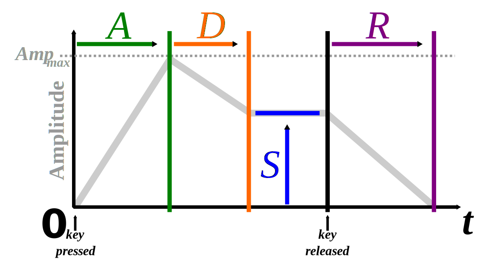

The p5.sound library extends p5 with Web Audio functionality including audio input, playback, analysis and synthesis.

[P5 Sound Library Reference](http://p5js.org/reference/#/libraries/p5.sound)

### Oscillator

[p5.Oscillator](https://p5js.org/reference/#/p5.Oscillator)

Using the p5 sound library, you can create an Oscillator with 4 possible wave types. The default is a sine wave but you can specify the wave type using the `setType()` method. 

### Envelope

Envelopes are pre-defined amplitude distribution over time. Typically, envelopes are used to control the output volume of an object, a series of fades referred to as **Attack**, **Decay**, **Sustain** and **Release** (ADSR).

[p5.Env](https://p5js.org/reference/#/p5.Env)

[ADSR Envelope](https://en.wikipedia.org/wiki/Synthesizer#Attack_Decay_Sustain_Release_.28ADSR.29_envelope)

### Links & Resources

Jason Sigal's Music Viz [GitHub Repo](https://github.com/therewasaguy/p5-music-viz)
