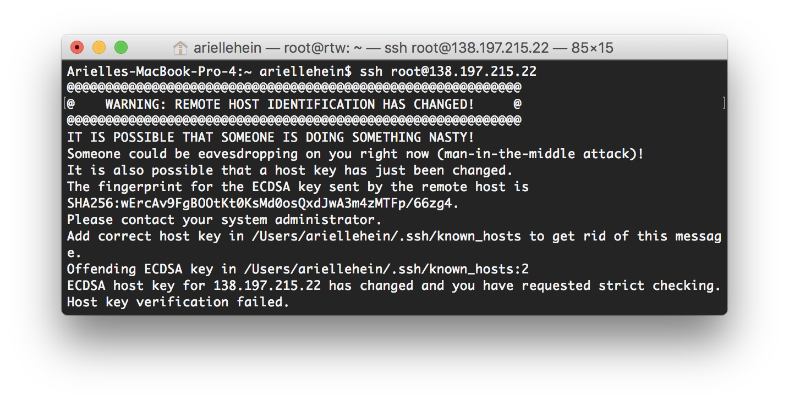

A few of you have encountered this digital ocean error: 

Here is the solution:

`ssh-keygen -R hostname`

Make sure you replace hostname with your droplet's IP address or domain name (whichever you use to ssh in).